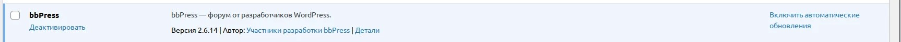
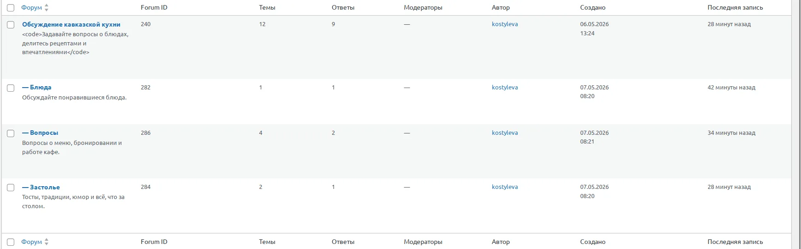
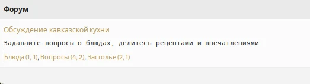
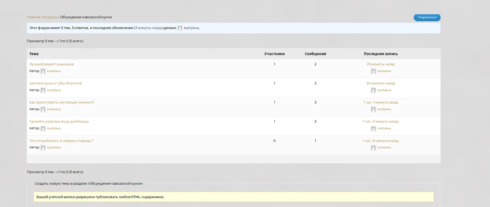
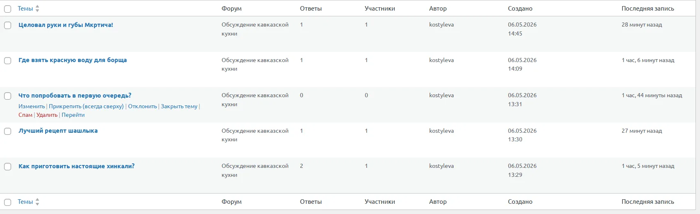
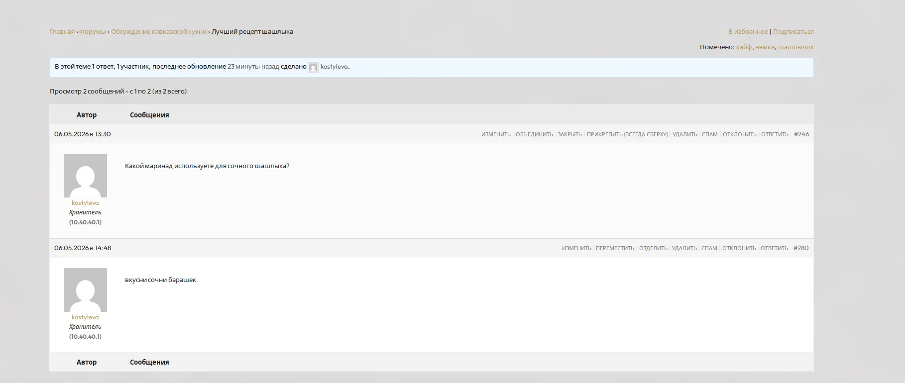
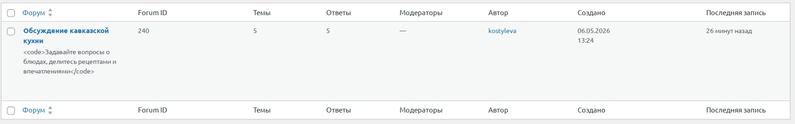

# Кафе кавказской кухни — меню и бронирование

## Отчёт по заданию День 8: Форум и простое тестирование

**Ветка:** `Kostylevakaterina72-coder`  
**Плагин:** bbPress

---

### Пошаговая инструкция по установке и настройке форума

1. **Установка плагина**  
   - В админке WordPress перешла в *Плагины → Добавить новый*.  
   - Нашла плагин **bbPress**, установила и активировала его.  

   

2. **Создание форума и категорий**  
   - Перешла в *Форумы → Добавить новый*.  
   - Создала форум **«Обсуждение кавказской кухни»**.  
   - Добавлены категории для удобной навигации.  

     
   

3. **Наполнение контентом (по требованиям)**  

   **Темы форума (минимум 3):**  
     
     

   **Сообщения в темах (минимум 3):**  
     

   **Общий вид обсуждений:**  
     
   

4. **Правила форума**  
   - Добавлены и закреплены правила поведения на форуме.  

   

---

### Результаты тестирования

| Что проверялось | Результат | Примечание |
|----------------|-----------|-------------|
| Открывается ли форум | ✅ Да | |
| Создаётся ли новая тема | ✅ Да | |
| Отправляется ли сообщение в теме | ✅ Да | |
| Есть ли ошибки при работе | ✅ Нет | |
| Форум соответствует теме сайта | ✅ Да | Кавказская кухня |
| Форум доступен через меню | ✅ Да | |
| Минимум 1 форум | ✅ Да | |
| Минимум 3 темы | ✅ Да | |
| Минимум 3 сообщения | ✅ Да | |
| Созданы категории форума | ✅ Да | см. скриншоты |
| Добавлены правила форума | ✅ Да | см. `Правила.png` |

---

### Вывод

Форум успешно установлен, настроен и протестирован. Все обязательные критерии (1 форум, 3 темы, 3 сообщения, доступность через меню, отсутствие ошибок) выполнены. Также дополнительно созданы категории и добавлены правила форума. Форум органично вписывается в тематику сайта кавказской кухни.
