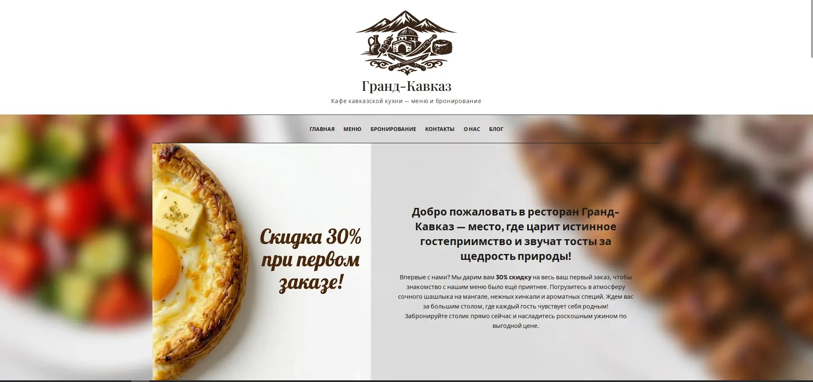
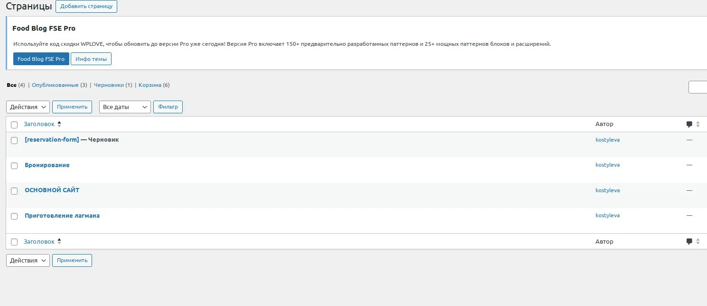
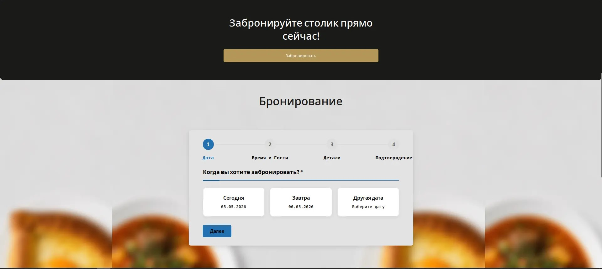

# 🍴 Ресторан «Гранд-Кавказ»

Добро пожаловать в репозиторий сайта ресторана кавказской кухни.  
Проект включает в себя функционал **просмотра меню** и **систему бронирования** столов.

> 🚀 Ветка: `grand-cavkaz`

---

## 📸 Визуальная часть проекта

### 🖼️ Главная страница


### 🍽️ Полное меню


### 📑 Разделы меню


### 📄 Страницы (пример верстки)


### 🥘 Пример карточки бронирования / блюда


### 👨‍🍳 Наш персонал


### 📋 Консоль просмотра заявок на бронирование


---

## ⚙️ Основной функционал

- **Кавказское меню** (горячие блюда, мангал, выпечка)
- **Онлайн-бронирование** столов
- **Панель управления** для просмотра заявок
- Адаптивный дизайн

---

## 🛠️ Как запустить

1. Клонируйте репозиторий:
   ```bash
   git clone https://github.com/kostylevakaterina72-coder/grand-cavkaz.git
