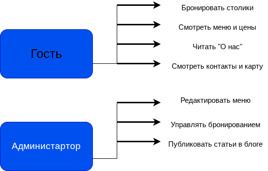

# 🍽️ Кафе кавказской кухни — меню и бронирование столиков

## 📌 О проекте
[Скачать техническое задание (ТЗ)](./ТЗ_Костылева_Зозуля(1).docx)

Веб-сайт для кафе кавказской кухни, который позволяет:
- знакомить гостей с меню и ценами;
- бронировать столики онлайн;
- управлять контентом через админку WordPress.

Сайт разработан на CMS WordPress с использованием связки **LAMP** (Linux, Apache, MySQL, PHP).

---

## 🎯 Целевая аудитория

- Посетители кафе (взрослые, туристы, любители кавказской кухни)
- Гости, желающие забронировать столик
- Администратор кафе (управление меню и бронированиями)

---

## 🧭 Структура сайта (6 страниц)

| Страница       | Описание |
|----------------|----------|
| Главная        | Приветствие, фото зала, ссылки на меню и бронирование |
| Меню           | Список блюд кавказской кухни с ценами и описанием |
| О нас          | Информация о кафе, шеф-поваре, традициях |
| Бронирование   | Форма: имя, дата, время, количество гостей, телефон |
| Контакты       | Адрес, телефон, часы работы, встроенная карта (Яндекс.Карты) |
| Блог           | Статьи о кавказской кухне, новости кафе |

---

## ⚙️ Функциональные возможности

- [x] Просмотр меню и цен
- [x] Онлайн-бронирование столика через форму
- [x] Отправка бронирований администратору
- [x] Отображение контактов и карты
- [x] Публикация новостей / статей в блоге
- [x] Редактирование контента через админку WordPress

---

## 📊 Диаграммы проекта

### Диаграмма прецедентов (Use Case Diagram)

### Диаграмма развертывания (Deployment Diagram)

.png )

---

## 🧱 Технологический стек

| Технология       | Назначение |
|------------------|-------------|
| Linux (Debian)   | ОС сервера |
| Apache           | Веб-сервер |
| MySQL (MariaDB)  | База данных |
| PHP              | Язык программирования |
| WordPress        | CMS |
| GitHub           | Хранение кода, ТЗ и диаграмм |

---

## 👥 Авторы

- Костылева
- Зозуля

---

## 📄 Лицензия

Проект выполнен в учебных / рабочих целях. Все права на контент кафе принадлежат владельцам.
